## 行列式的性质及计算

**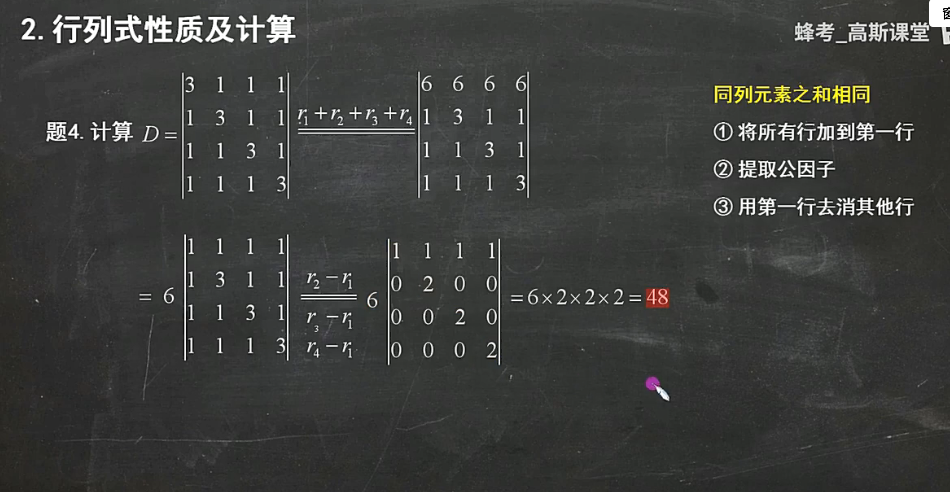**

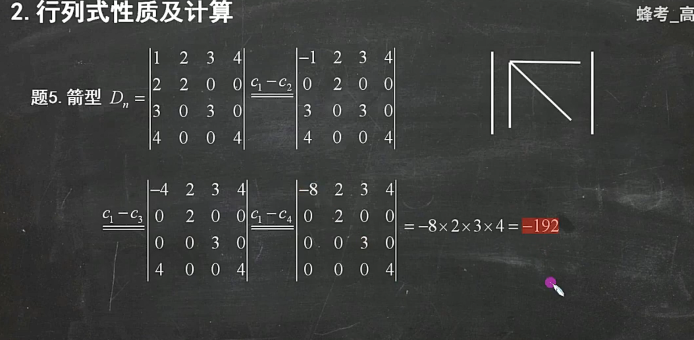

*箭型用列相减

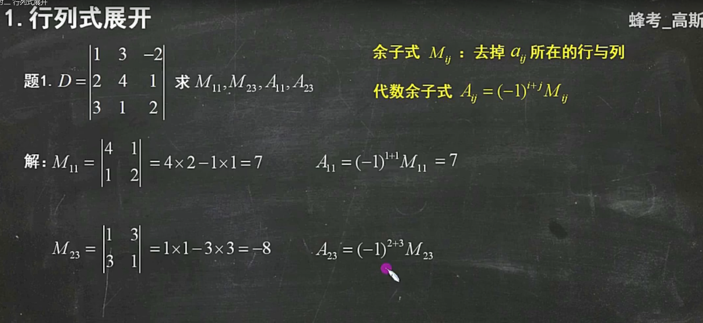

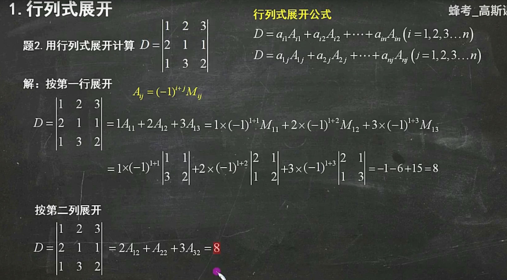

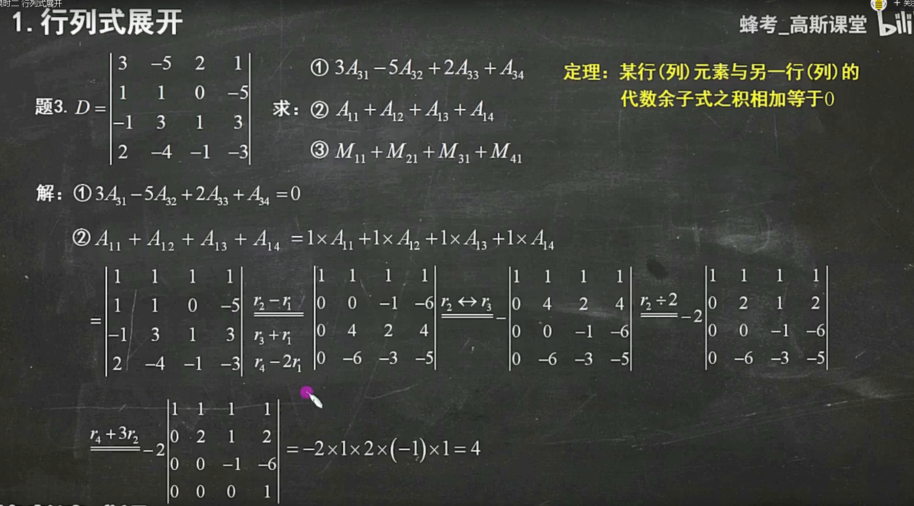

*第二题将系数代进第一行直接进行计算，第三题同理，但先将余子式转换成数还余子式

### 范德蒙行列式

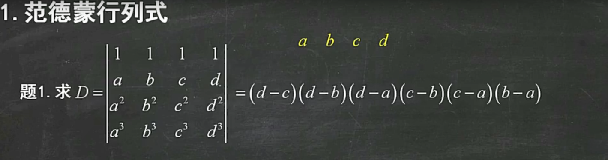

### 矩阵和行列式的区别

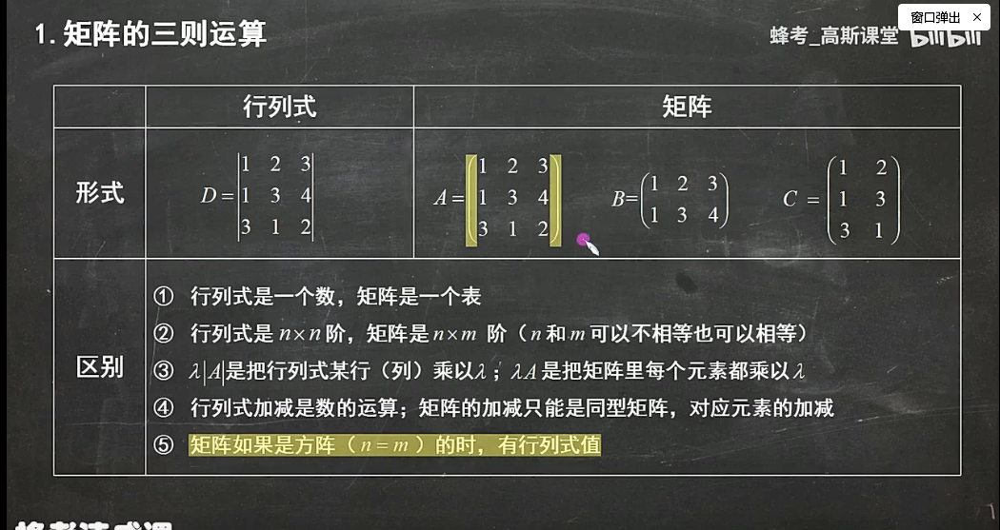

### 矩阵的乘法

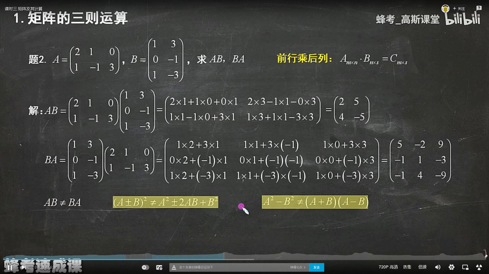

### 转置矩阵、伴随矩阵、单位矩阵、逆矩阵

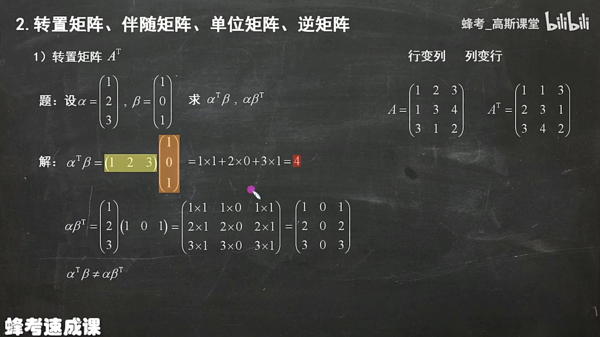

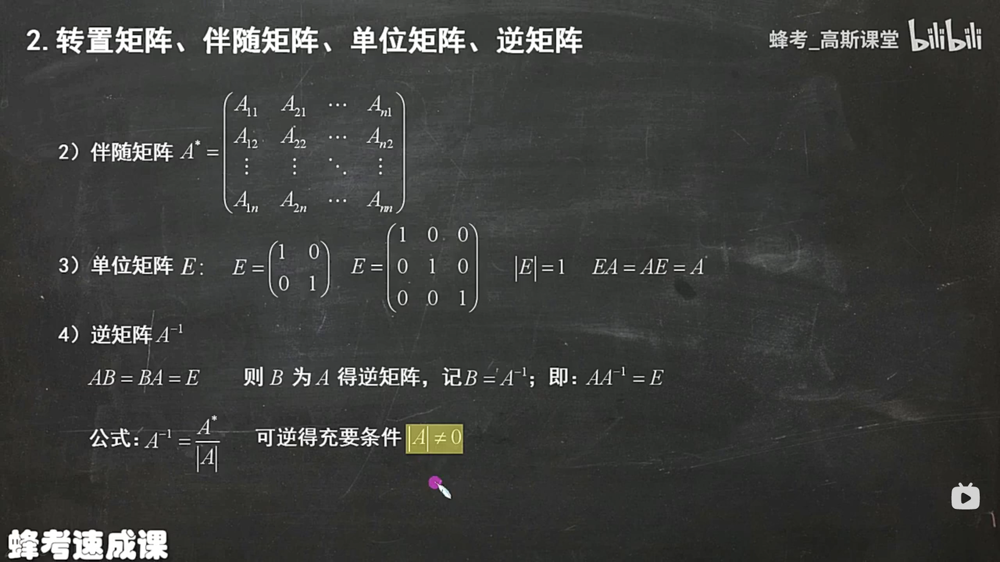

- 伴随矩阵即求每位的代数余子式并进行逆置
- 单位矩阵主对角线都为1

### 各种矩阵的性质

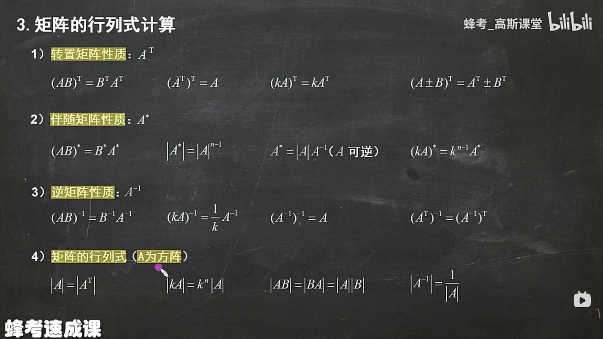

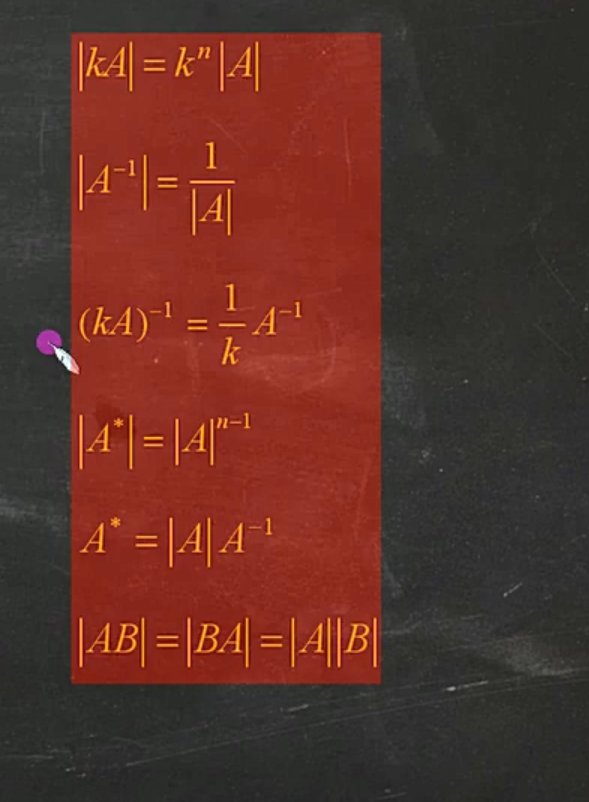